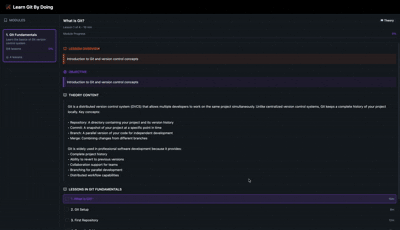

# Git-D3-Viz Documentation

Welcome to the Git-D3-Viz documentation. This folder contains comprehensive guides for understanding and working with the project.

## Demo Video 

## Documentation Index

- **[Project Overview](docs/PROJECT_OVERVIEW.md)** - High-level description of the project, its purpose, and key features
- **[Architecture Guide](docs/ARCHITECTURE.md)** - Technical architecture, component structure, and data flow
- **[Setup & Installation](docs/SETUP.md)** - How to set up the project locally and get started
- **[Component Guide](docs/COMPONENTS.md)** - Detailed documentation of each React component
- **[Development Guide](docs/DEVELOPMENT.md)** - Guidelines for developing and contributing to the project
- **[API Reference](docs/API_REFERENCE.md)** - Types, interfaces, and data structures

## Quick Links

- [GitHub Repository](https://github.com/kiridharan/git-d3-viz)

## Tech Stack

- **Frontend Framework**: React 18 + TypeScript
- **Build Tool**: Vite
- **Visualization**: D3.js
- **Styling**: Tailwind CSS + shadcn-ui
- **Routing**: React Router v6
- **State Management**: Zustand

## Getting Started

1. Clone the repository
2. Install dependencies: `pnpm i` or `pnpm install`
3. Start development server: `pnpm run dev`
4. Open `http://localhost:5173` in your browser

For detailed setup instructions, see [Setup & Installation](docs/SETUP.md).
